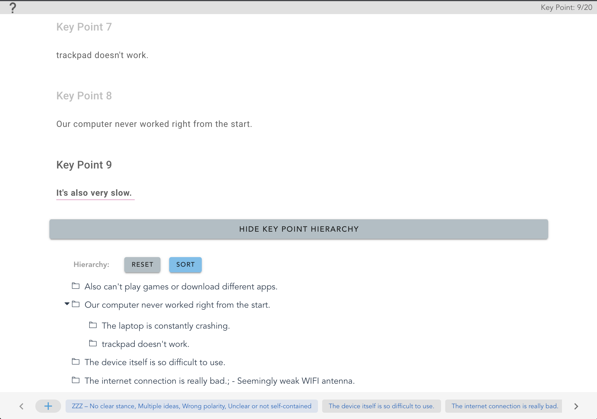
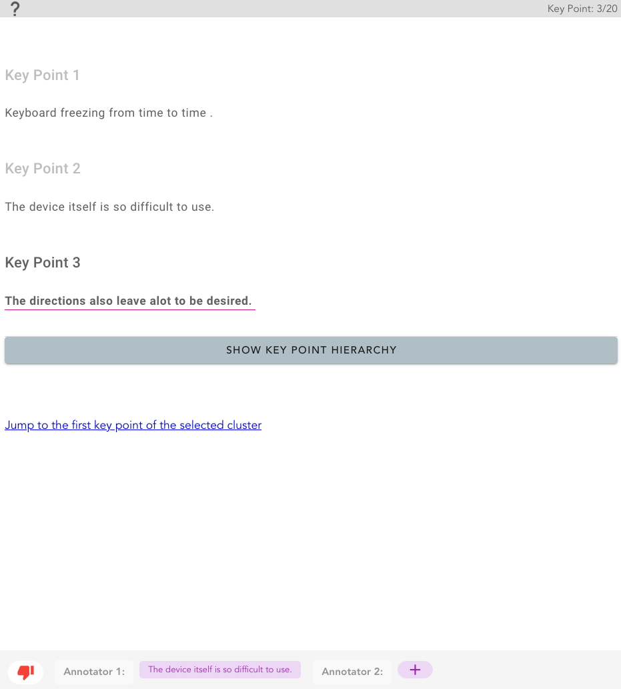
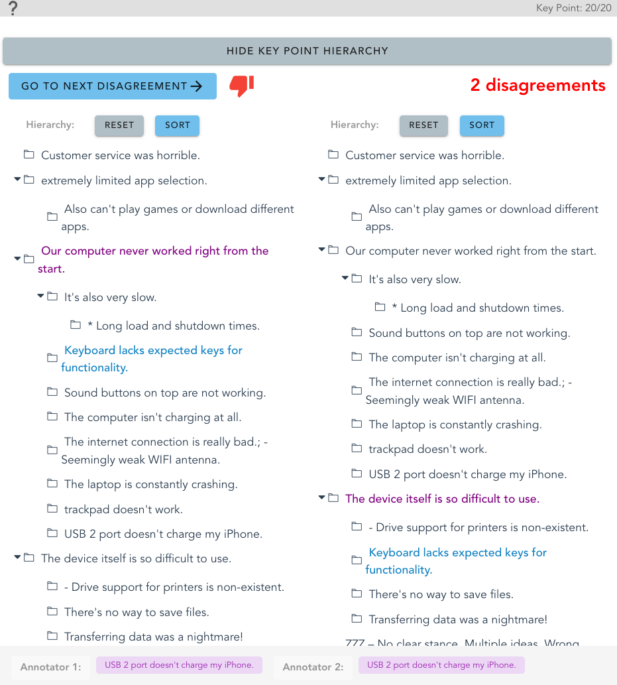

# CHAMP 

This repository includes the code for the following paper (to appear to EMNLP 2023):
[CHAMP: Efficient Annotation and Consolidation of Cluster Hierarchies](https://arxiv.org/pdf/2311.11301.pdf). 

CHAMP is an effective tool for annotating and consolidating a hierarchy of clusters. 


## Annotation:




## Consolidation

<p align="center">
  
  
</p>


For a full walkthrough of CHAMP's features, check out our system demonstration video on [youtube](https://youtu.be/1n4d6RyAP0M|).


## How to use CHAMP?

### 1.  Annotation portal 

The easiest way to use CHAMP is with the annotation portal ([website](https://cattana.pythonanywhere.com/); [repo](https://github.com/ariecattan/champ-demo)), which allows you to update a JSON configuration file for annotation or consolidation, perform the task and download it upon completion. Then, you can upload again the annotation to vizualize your annotation. 

### 2. CDN 

Load `CHAMP` using CDN and embed the app as a WebComponent

```html
<script src="https://unpkg.com/vue"></script>
<script src="https://github.com/ariecattan/champ/releases/download/v1.0.0/champ-app.min.js"></script>

<link href="https://fonts.googleapis.com/css?family=Roboto:100,300,400,500,700,900" rel="stylesheet">
<link href="https://cdn.jsdelivr.net/npm/@mdi/font@5.x/css/materialdesignicons.min.css" rel="stylesheet">
<link href="https://cdn.jsdelivr.net/npm/vuetify@2.x/dist/vuetify.min.css" rel="stylesheet">
<link href="https://fonts.googleapis.com/css?family=Material+Icons" rel="stylesheet">
```


```html
<champ-app json="{html escaped json config}" ></champ-app>
```

Results can be then extracted as follows:

```javascript
let champ = document.getElementsByTagName("champ-app")[0].vueComponent;
let results = {tokens:champ.tokens, mentions:champ.mentions}
JSON.stringify(results);
```

### 3. Install CHAMP locally

Clone this repo to your local machine 

```shell 
$ git clone https://github.com/ariecattan/champ.git
```

Then run the following npm commands to install and run the tool locally.
```shell
$ npm install
$ npm run serve 
```

If you want to create your own WebComponent, run the following:
```shell
$ npm run build
```

## Configurate champ

You can find example of input JSON files for each model in `src/examples`. 

See below the important parameters in the JSON config file:
* `mode`: (onboarding, annotation, reviewer)
* `hierarchy`: (true or false) whether to allow or not annotation of hierarchy between clusters
* `tokens`: list of flatten tokens from all documents, each token needs to include {`i`: incremental index, `document`: doc_id of the document, `text`} and optionally `paragraph` 
* `mentions`: list of candidate mentions to annotate, each mention needs to include {`start`, `end`}. In addition, in the onboarding and reviewer mode, you also need to add a `clustId` field for each mention, which is an array of cluster IDs. The format of each cluster ID is "start-end" of the first mention in the cluster. For the annotation mode, only the first mention needs to have a `clustId`. 
* `local`: True of False, whether to add a button for downloading the annotation at the end of the annotation. The downloaded annotation file can be further uploaded to the tool for vizualizing your annotation/consolidation. 

The hierarchy of clusters is built using simple drag-and-drop operations. 

Anntotators may also add notes for each node.


Please refer to our [website](https://scico.apps.allenai.org/tool) for more details on the tool functionaly. 


## Useful scripts

* Given multiple annotated JSON files for the same topic, create an input configuration file for consolidation:
```bash
python scripts/create_consolidation_file.py --input path/to/file1 path/to/file2 ... --output path/to/output
```

* Post-process CHAMP annotated files: create a simple machine-readable `data.jsonl` file for all annotated files in a directory and optionally create human-readable files for each annotation file.
```bash
input_dir= # path to directory of CHAMP output 
output_dir= # where to save the data.jsonl file

python scripts/process_champ_files.py --input_dir $input_dir --output_dir $output_dir --viz
```


* Compute IAA between multiple `data.jsonl` files. The script can process any number of annotators and will print a table `n x n` with the F1 score between every pair of annotators. Check out our [paper](https://aclanthology.org/2023.acl-long.52.pdf) for more details about the agreement scores.

```bash
python scripts/compute_agreement.py --annotators /path/to/data1.jsonl /path/to/data2.jsonl ... 
```

By default, the above script will average the agreement score on all common topics between annotator pairs. If you want to compute agreement only on some specific topics, just add a flag `--topics ...`

## License

[](http://badges.mit-license.org)

- **[MIT license](http://opensource.org/licenses/mit-license.php)**